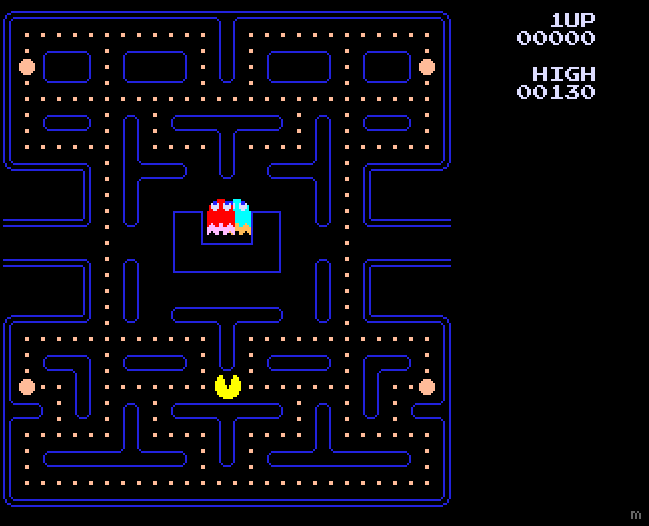

## macman

Simple pac-man clone written by hand in Amiga assembly - eat all dots to ... "win". For educational purposes only.

### How to debug

Install Visual Studio Code with Amiga Assembly extension.

### How to run

Download either .adf (floppy image) or .zip (hard disk image) from the Releases tab and mount
in an emulator targeting A500.

### Notes to self

From the perspective of a basic Amiga 500:

* Amiga doesn't have a MMU but allows multi-tasking so any non-booter program should be position-independent. We achieve this by not using absolute jump instructions (jmp, jsr) in favor of their PC-relative counterparts (bra, bsr). For storing global variables we define a memory block 'vars' with each variable represented as an offset automatically generated by RS macros. We then always keep the address of our 'vars' block in a6 register and can use relative addressing e.g. frameNo(a6) to access a specific variable. This is more flexible than a simpler approach of always using PC offset addressing e.g. frameNo(pc) as more instructions support the former mode.

* Amiga has two primary types of memory: Chip RAM which can be accessed by both CPU and co-processors, and Fast RAM which can only be accessed by the CPU. Agnus chip interleaves DMA access to Chip memory between CPU and co-processors on every other cycle. Bitplane/graphics assets are therefore always in Chip RAM but game state can/should be in Fast RAM. A third type, Slow RAM, is the worst of both worlds with only CPU being able to access it while still having to go via Agnus (it's a common A500 memory expansion).

* Besides the CPU, Amiga has two co-processors: Copper and Blitter. The CPU communicates with those by writing into their dedicated hardware registers.

    * Copper is a co-processor that allows synchronisation with the video beam. It executes its own program called a Copper List stored in Chip RAM on every frame. Based on the position of the beam it's able to modify values of other hardware registers, effectively changing palettes, moving sprites etc. When using direct hardware access on the Amiga it's necessary to have at least a basic Copper List which resets bitplane pointers at the beginning of each frame as hardware increments them as they are being drawn; we also use a Copper List to display ghosts' sprites. The Copper List can be static, generated via code and/or modified by the CPU at any time (to change sprite positions for example). Copper Lists only use three instructions (WAIT, MOVE, SKIP).

    * Blitter is a co-processor for quickly copying rectangular+ blocks of memory, it's most often used to draw objects on screen which won't fit into hardware sprites. It only operates on words meaning to draw an object at non-16 pixel boundary (because bitplanes) we need to use its shifting and masking functionality. It does offer a variety of copy modes mixing 3 different sources so it's able to draw objects with transparency (A - sprite, B - mask, C - screen => D - screen). Here map tiles, text as well as macman himself are drawn using Blitter.

* Video memory is represented through bitplanes and these can reside anywhere within Chip RAM (we simply write pointers to each bitplane in hardware registers). The layout is flexible as well and I use line-interleaved layout (1st line of 1st bitplane, 1st line of 2nd bitplane, etc.) as it makes it possible to draw an object on screen using a single Blitter copy operation (thanks to modulo support), rather than having to copy each bitplane separately.

* Amiga supports 8 hardware sprites, 16 pixels wide and unlimited height. They are however grouped into pairs with each pair only being able to use 3 fixed palette slots plus transparency. To keep things simple I only represent the 4 ghosts as hardware sprites (so I don't need to pair them and each can have 3 colors it needs) and macman is drawn using Blitter.

* Python scripts in assets directory convert .png assets into bitplane/binary forms expected by code, adding padding where necessary (Blitter words). Only return.inc has been hand-crafted as it contains the return direction for ghost eyes for each position on the map.

### Resources used

* [Amiga Hardware Reference Manual](http://amigadev.elowar.com/read/ADCD_2.1/Hardware_Manual_guide/node0000.html)
* [Amiga programming examples by Sakura-IT](https://github.com/Sakura-IT/Amiga-programming-examples)
* [Amiga Assembly extension for Visual Studio Code](https://marketplace.visualstudio.com/items?itemName=prb28.amiga-assembly)
